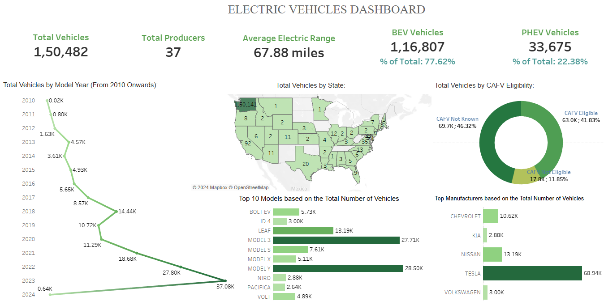

# Electric Vehicle Market Analysis Dashboard

## 🌐 Overview

This repository contains a comprehensive analysis of the electric vehicle (EV) market, focusing on Battery Electric Vehicles (BEVs) and Plug-in Hybrid Electric Vehicles (PHEVs). The analysis includes key performance indicators (KPIs) and various visualizations to provide insights into the market trends and technological advancements of EVs.

## 📋 KPI Requirements

### 1. Total Vehicles
- **Objective:** Understand the overall landscape of electric vehicles, encompassing both BEVs and PHEVs, to assess the market's size and growth.

### 2. Average Electric Range
- **Objective:** Determine the average electric range of the electric vehicles in the dataset to gauge the technological advancements and efficiency of the EVs.

### 3. Total BEV Vehicles and % of Total BEV Vehicles
- **Objective:** Identify and analyze the total number of Battery Electric Vehicles (BEVs) in the dataset.
- **Calculation:** Calculate the percentage of BEVs relative to the total number of electric vehicles, providing insights into the dominance of fully electric models.

### 4. Total PHEV Vehicles and % of Total PHEV Vehicles
- **Objective:** Identify and analyze the total number of Plug-in Hybrid Electric Vehicles (PHEVs) in the dataset.
- **Calculation:** Calculate the percentage of PHEVs relative to the total number of electric vehicles, offering insights into the market share of plug-in hybrid models.

## 📈 Charts Requirement

### 1. Total Vehicles by Model Year (From 2010 Onwards)
- **Visualization:** Line/Area Chart
- **Description:** This chart will illustrate the distribution of electric vehicles over the years, starting from 2010, providing insights into the growth pattern and adoption trends.

### 2. Total Vehicles by State
- **Visualization:** Map Chart
- **Description:** This chart will showcase the geographical distribution of electric vehicles across different states, allowing for the identification of regions with higher adoption rates.

### 3. Top 10 Total Vehicles by Make
- **Visualization:** Bar Chart
- **Description:** Highlight the top 10 electric vehicle manufacturers based on the total number of vehicles, providing insights into the market dominance of specific brands.

### 4. Total Vehicles by CAFV Eligibility
- **Visualization:** Pie Chart or Donut Chart
- **Description:** Illustrate the proportion of electric vehicles that are eligible for Clean Alternative Fuel Vehicle (CAFV) incentives, aiding in understanding the impact of incentives on vehicle adoption.

### 5. Top 10 Total Vehicles by Model
- **Visualization:** Tree Map
- **Description:** Highlight the top 10 electric vehicle models based on the total number of vehicles, offering insights into consumer preferences and popular models in the market.

## 📊 Dashboard

